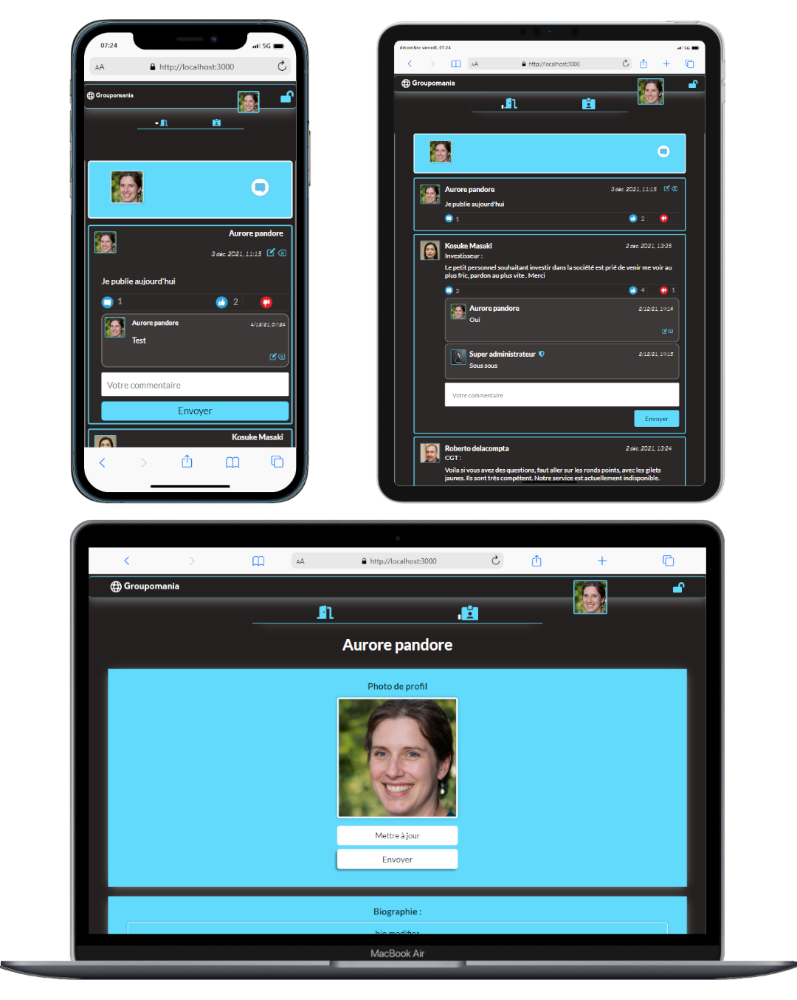

# - OpenClassrooms Projet 07 -

## Créez un réseau social d’entreprise



## Technologie :
```
Mysql - Sequelize - NodeJS - Express - ReactJS - Sass/Css
```

## Tout d'abord : 

- clonez le répository 

## Installation back-end : 

Allez dans le fichier backend 
```
npm i
```
```
npm start
```

## Installation front-end : 

Allez dans le fichier frontend
```
npm i
```
```
npm start
```

## Installation Database : 

- Un fichier dans backend/config/config.json permet de configurer la base de donnée relié a l'application, un dossier migration vous permettra de créez les tables directement comme ceci :

```
 "development": {
    "username": "root",
    "password": "47571971",
    "database": "database_development_p7",
    "host": "127.0.0.1",
    "dialect": "mysql"
  }
```

- Ensuite dans le backend : 
```
sequelize db:create
```
```
sequelize db:migrate
```

## Administration de l'application : 

- La seule façon de créer un administrateur, serra donc de l'intégrer de façon manuelle sur la base de données afin d'éviter les problème lié à la sécurité de l'application.

## Problème possible :
- Aucun 
- Testé sous Windows / Linux sur deux appareils différents